<p align="center">
  
</p>

<h1 align="center">Baton</h1>

<p align="center"><strong>Customer support that knows when to pass the baton.</strong><br/>
A RAG assistant that answers from your help centre with citations — and when it shouldn’t answer, hands the customer to a person along with everything it already knows.</p>

<p align="center">
  
</p>

---

## Contents

- [The problem](#the-problem)
- [What Baton does](#what-baton-does)
- [Screenshots](#screenshots)
- [How it works](#how-it-works)
- [Getting started](#getting-started)
- [Tech stack](#tech-stack)
- [Project structure](#project-structure)
- [Configuration](#configuration)
- [Security model](#security-model)
- [Evaluation results](#evaluation-results)
- [Monitoring and tracing](#monitoring-and-tracing)
- [API reference](#api-reference)
- [Testing](#testing)
- [Limitations and roadmap](#limitations-and-roadmap)
- [Data and acknowledgements](#data-and-acknowledgements)

## The problem

Support chatbots usually fail in one of two ways:

1. **They don’t know when to stop.** They keep guessing on questions they can’t answer, invent policies, or loop through “Could you rephrase that?” while the customer gets angrier. Fraud reports, legal threats and account deletions get the same canned treatment as “where’s my order?”.
2. **When they do give up, the context is lost.** The customer lands in a queue and an agent opens a blank conversation: *“Hi, how can I help?”* The customer explains everything again. The bot’s work is thrown away, and so is the customer’s patience.

In most systems a human handoff is an error path — an exception bolted onto the side of the bot. Baton treats it as a **first-class state** of every conversation, with its own policy, its own data (the handoff brief), its own queue, SLA and metrics.

## What Baton does

| For | Baton gives them |
|---|---|
| **Customers** | Answers grounded in the help centre, with the articles cited. When the bot can’t help, an immediate, explained handoff — and the agent already knows the story. |
| **Agents** | A prioritised handoff queue with SLA timers, and for every handoff a **brief**: why the bot stepped aside, a summary, open questions, what the bot already tried (with confidence), extracted entities (order IDs, amounts, emails), sentiment trend, the sources it retrieved, suggested next steps and the matching internal procedure. After accepting, a **copilot** keeps drafting cited replies. |
| **Admins** | Agent management (capacity, enable/disable), every conversation across agents, the handoff policy editable at runtime, and an overview of handoff reasons, bot answer rate and offline evaluation scores. |

**When the bot steps aside.** A policy checks every customer turn. If several signals fire, the primary one is chosen in this order:

| Reason | Trigger | LLM called? |
|---|---|---|
| `sensitive_topic` | Fraud or unauthorised charge, legal threat, account or data deletion, product safety | No |
| `customer_request` | The customer asks for a person | No |
| `negative_sentiment` | Sentiment at or below the threshold (default −0.5) | No |
| `repeated_failure` | Two turns in a row without a grounded answer | Yes |
| `low_confidence` | The question is outside the knowledge base (retrieval below the no-match threshold) | No |
| `assistant_unavailable` | The LLM failed or timed out — the customer never sees an error | Yes (failed) |
| `agent_initiated` | An agent takes over from the live bot queue | — |

## Screenshots

**Customer** — cited answers; a clear, explained handoff; then the agent joins the same conversation.

| Ask | Hand off | Agent joins |
|---|---|---|
| 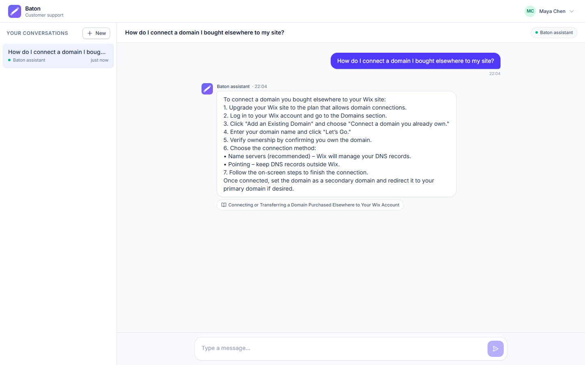 | 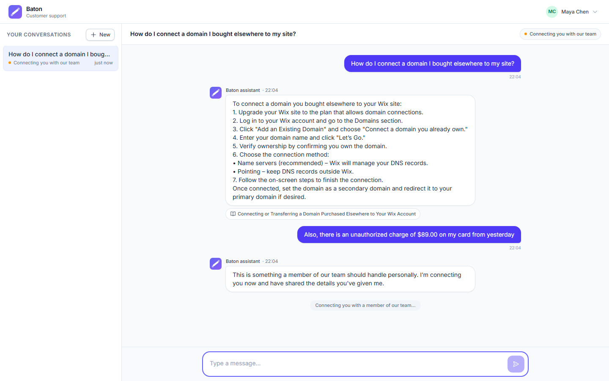 | 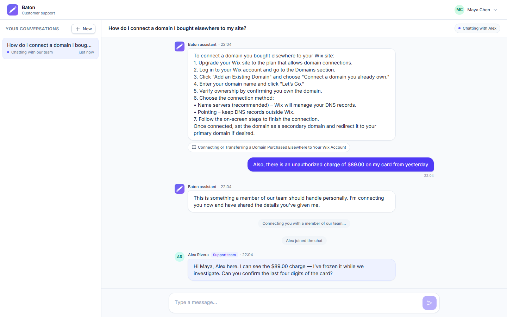 |

**Agent** — the queue sorted by urgency and wait, the brief beside the transcript, a copilot after accepting.

| Handoff brief | Working the conversation |
|---|---|
|  | 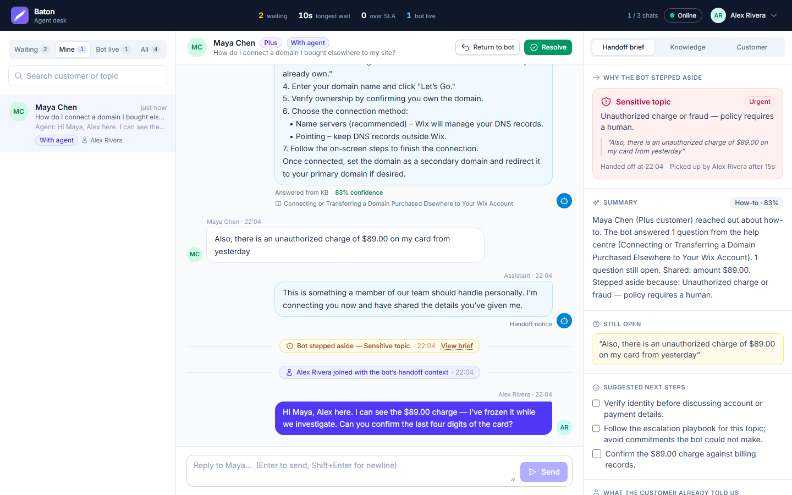 |

**Admin** — overview, agents, every conversation, and the handoff policy.

| Overview | Agents |
|---|---|
| 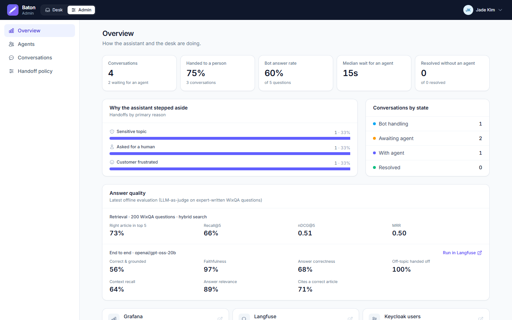 | 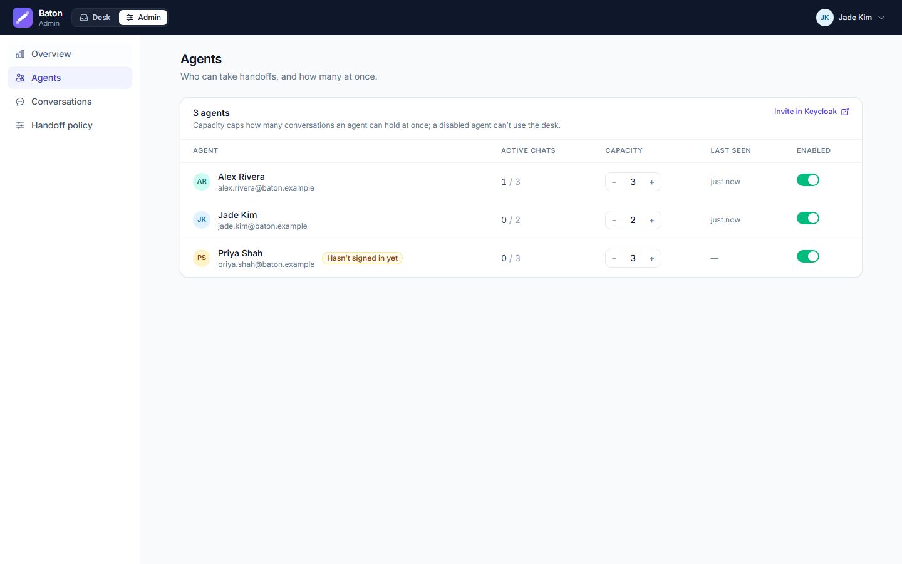 |
| **Conversations** | **Handoff policy** |
| 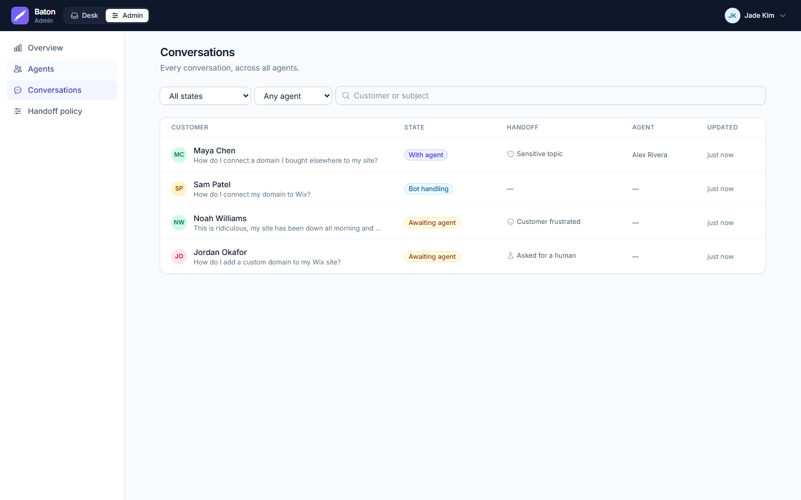 | 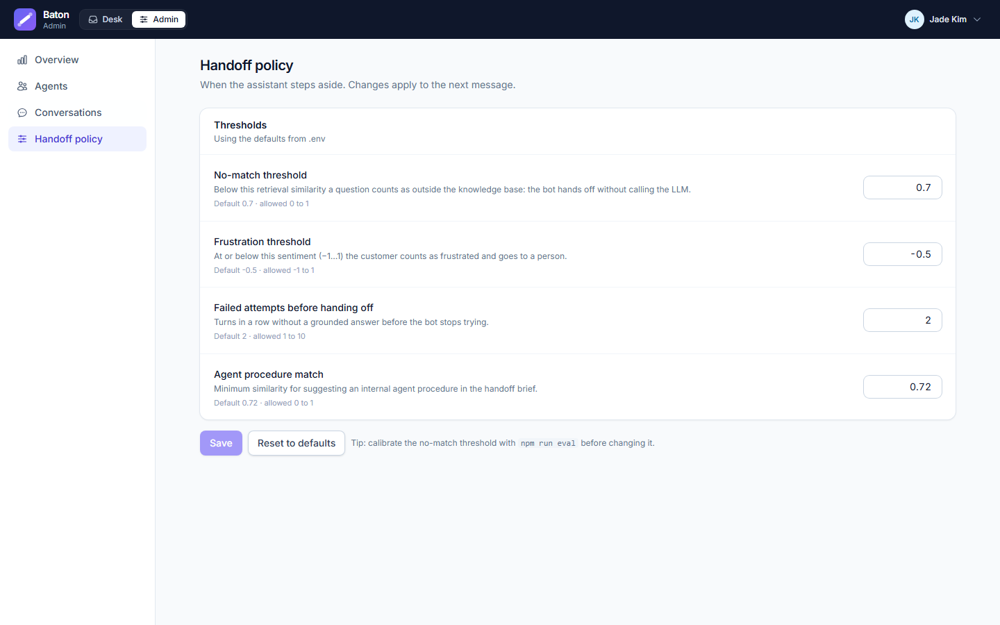 |

**Sign-in** — Keycloak (real stack), or a persona picker in demo mode.

| Keycloak | Demo mode |
|---|---|
| 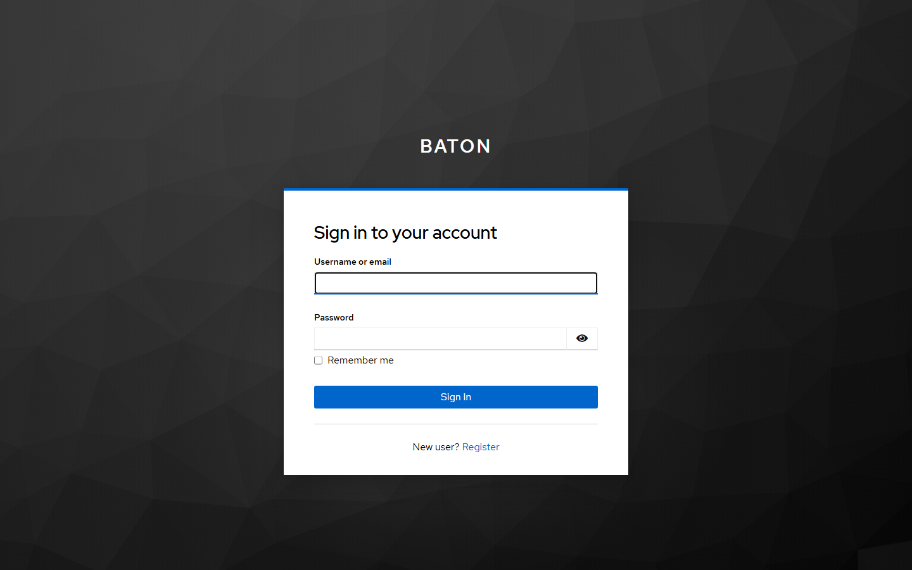 | 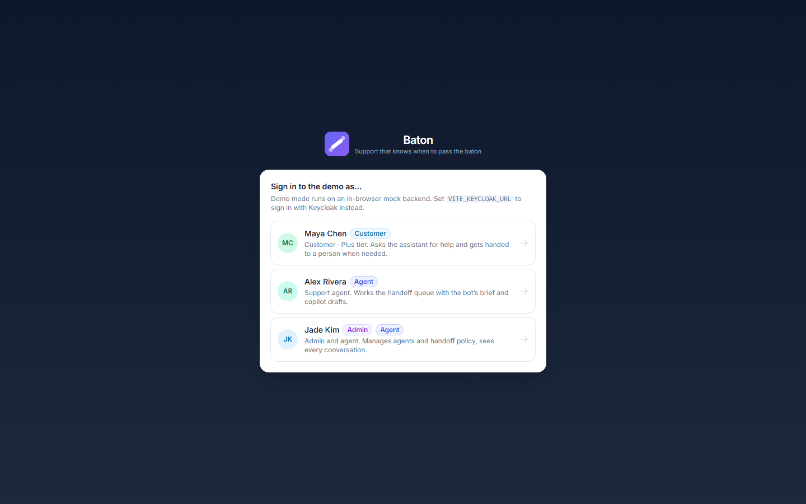 |

## How it works

### Architecture

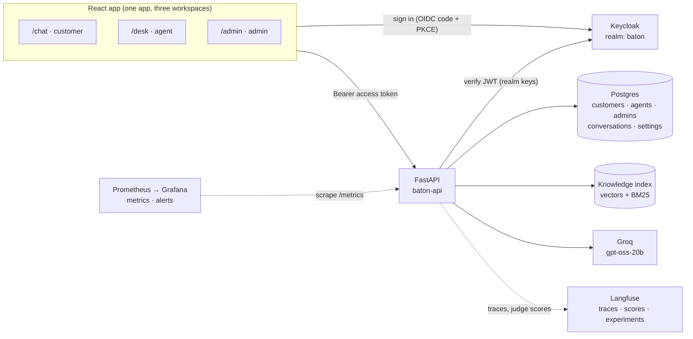

### The conversation lifecycle

```
bot_active ──(policy trigger)──▶ handoff_pending ──(accept)──▶ agent_active ──▶ resolved
     ▲                                                              │
     └──────────────────────────(return to bot)─────────────────────┘
```

A resolved conversation reopens when the customer replies. Every transition is an explicit API call (`accept`, `takeover`, `return`, `resolve`), traced and counted.

### One bot turn

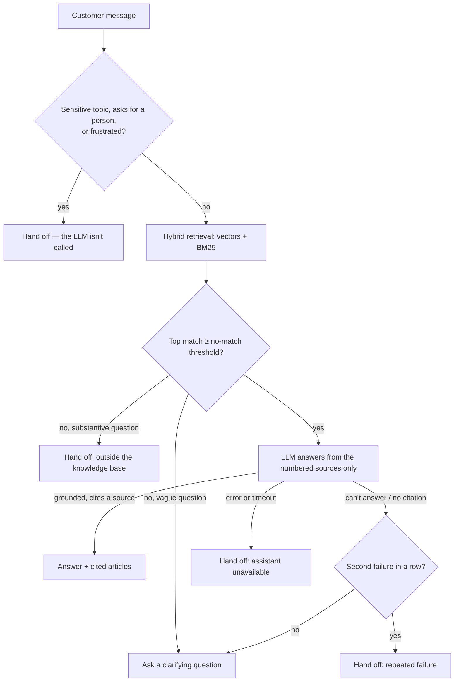

Every handoff builds the **brief** in the same step, enriched with this turn’s retrieval and the closest internal agent procedure (from the ABCD dataset, visible to agents only).

### Knowledge: ingestion and retrieval

```
sources (local Markdown · WixQA help centre · ABCD agent procedures)
  → HTML to structured Markdown → normalisation (NFKC, boilerplate removal)
  → heading-aware chunking (50–450 tokens) → de-duplication (shared text kept once, linked to every article)
  → incremental embedding (bge-small-en-v1.5, local CPU) → vector + BM25 index in data/index/
```

- **Freshness without re-embedding.** Each source has a refresh window and a cheap version check (HTTP HEAD or file hash); documents are diffed by content hash; each vector is keyed by a hash of its exact input text and the model. Unchanged text is never re-embedded, and an interrupted build resumes from a checkpoint.
- **Hybrid retrieval.** Vector search and BM25 merged with reciprocal rank fusion: BM25 catches exact strings (order numbers, promo codes) that embeddings miss.
- **Two different questions, two different signals.** The top result’s cosine similarity answers *“is this in scope?”* (the no-match gate). Whether the sources actually answer the question is left to the LLM, which must cite them — an uncited answer counts as “can’t answer”.

### Users, roles and sign-in

Keycloak owns identity (passwords, sessions, roles); the app database owns what Baton needs to know about each person. There are three tables, one per kind of user:

| Role (Keycloak realm role) | Table | What the row holds | Workspace |
|---|---|---|---|
| `customer` | `customers` | tier, location, customer since, lifetime value, orders | `/chat` — their own conversations |
| `agent` | `agents` | capacity, enabled | `/desk` — the handoff queue |
| `admin` | `admins` | — | `/admin` — agents, conversations, policy, insights |

Rows are linked to Keycloak by the token’s `sub`. They are created on a person’s first sign-in; a pre-seeded profile (e.g. imported from a CRM) is claimed by its **verified** email. Every self-registered account is a customer; agents and admins are invited by an admin in Keycloak. Staff accounts never get a customer profile.

## Getting started

### Prerequisites

| Tool | Needed for |
|---|---|
| Node.js 20+ | the web app |
| Python 3.12+ and [uv](https://docs.astral.sh/uv/) | the API, ingestion and evaluation |
| Docker Desktop | Keycloak + Postgres (`infra/`) and the optional monitoring stack (`observability/`) |
| A [Groq API key](https://console.groq.com/keys) | answers and the evaluation judge |
| ~2 GB of disk | Python packages (CPU PyTorch), the embedding model and the index |

### Option A — Quick demo (one minute, no backend)

The web app ships with an in-browser mock backend and a persona picker, so you can try all three workspaces without Docker, Python or keys.

```bash
cp .env.example .env            # VITE_API_URL and VITE_KEYCLOAK_URL stay empty
cd frontend && npm install && cd ..
npm run dev                     # http://localhost:5173
```

Pick **Maya** (customer), **Alex** (agent) or **Jade** (admin). The mock uses a small keyword retriever instead of the real RAG pipeline.

### Option B — Full stack

**1. Configure.** Copy the template and fill in the secrets (every variable is documented in the file):

```bash
cp .env.example .env
```

At minimum set `GROQ_API_KEY`, the `change-me` passwords, `BATON_DB_PASSWORD` (and the same password inside `DATABASE_URL`), and for the web app `VITE_API_URL=http://localhost:8787` and `VITE_KEYCLOAK_URL=http://localhost:8080`.

**2. Start Keycloak and Postgres.** The `baton` realm — roles, clients and demo users — is imported on first start.

```bash
npm run infra:up                # Keycloak :8080 · Postgres :5433
```

**3. Install the backend and build the knowledge index.** The first build downloads the datasets and the embedding model and embeds ~24,000 chunks on the CPU (about an hour; it resumes if interrupted). Later runs only process what changed.

```bash
cd backend && uv sync && cd ..
npm run ingest
```

**4. Run the API and the web app** (two terminals):

```bash
npm run api                     # http://localhost:8787 · OpenAPI docs at /docs
npm run dev                     # http://localhost:5173
```

**5. Sign in** with a demo account. The password for all of them is `BATON_DEMO_PASSWORD` from your `.env`.

| Username | Role | Lands on |
|---|---|---|
| `maya.chen`, `jordan.okafor`, `sam.patel`, `noah.williams`, … | customer | `/chat` |
| `alex.rivera`, `priya.shah` | agent | `/desk` |
| `jade.kim` | admin + agent | `/desk`, with `/admin` one click away |

Or click **Register** on the sign-in page to create a new customer.

**6. Optional — monitoring and evaluation.**

```bash
npm run obs:up                  # Langfuse :3000 · Grafana :3001 · Prometheus :9092
npm run eval                    # retrieval metrics + suggested thresholds (no LLM)
npm run eval:rag                # end-to-end experiment in Langfuse (LLM + judge)
```

### Commands

| Command | What it does |
|---|---|
| `npm run dev` / `npm run build` | Web app dev server / production build |
| `npm run api` | FastAPI server (`baton-api`) |
| `npm run ingest` | Build or incrementally update the knowledge index (`baton-ingest`) |
| `npm run eval` / `npm run eval:rag` | Retrieval evaluation / end-to-end Langfuse experiment |
| `npm test` | Backend test suite |
| `npm run infra:up` / `infra:down` / `infra:logs` | Keycloak + Postgres |
| `npm run obs:up` / `obs:down` / `obs:logs` | Langfuse + Prometheus + Grafana |
| `cd backend && uv run baton-search "query"` | Search the index from the terminal |

## Tech stack

| Layer | Technology | Why |
|---|---|---|
| **Web app** | React 19 · Vite 8 · Redux Toolkit 2 (RTK Query, listener middleware) · Tailwind CSS 4 | Server data lives in the RTK Query cache (polling, optimistic updates); slices hold only UI state |
| **Auth (browser)** | keycloak-js — authorization code + PKCE, tokens in memory | No secrets in the browser; refresh handled by the adapter |
| **API** | Python 3.12 · FastAPI · Pydantic 2 · uvicorn | Typed request/response contract published as OpenAPI |
| **Auth (API)** | PyJWT — RS256 signature, issuer, audience and expiry checked locally against the realm’s keys | No call to Keycloak per request |
| **Identity provider** | Keycloak 26 (realm `baton`, roles `customer` / `agent` / `admin`) | Login, self-registration, brute-force protection, configurable password policies, admin console |
| **Database** | PostgreSQL 17 (psycopg 3, connection pool) | Users tables, conversations (JSONB), runtime settings |
| **Embeddings** | sentence-transformers · `BAAI/bge-small-en-v1.5`, local CPU | Free, no rate limits, good retrieval quality for its size |
| **Retrieval** | NumPy cosine search + BM25, reciprocal rank fusion; optional cross-encoder reranker | Exact-string recall plus semantic recall |
| **LLM** | Groq · `openai/gpt-oss-20b` (answers, copilot) · `openai/gpt-oss-120b` (judge) | Fast, cheap; the judge is a larger model than the one it grades |
| **Tracing & evaluation** | Langfuse 4 (self-hosted): traces, LLM-as-judge scores, datasets, experiments | Per-conversation detail and offline/online evaluation |
| **Monitoring** | Prometheus 3 · Grafana 13 (24-panel dashboard, 9 alert rules) | SLA, handoff rate, LLM latency, errors, tokens and cost |
| **Tooling** | uv · ruff · pytest · Docker Compose | — |

## Project structure

```
frontend/                     React app
  src/
    app/                      store, listener middleware (handoff toasts), tiny router
    auth/                     Keycloak session, demo personas, roles → workspaces, AuthGate
    api/                      RTK Query base (bearer token) + in-browser mock backend
    features/
      chat/                   customer workspace: conversations, thread, composer, starters
      conversations/ thread/ composer/ handoff/ customer/ agent/ notifications/   agent desk
      admin/                  overview, agents, conversations, handoff policy
      account/                GET /me (who is signed in, their profile rows)
    components/               brand mark, UI primitives
    layout/                   app header, workspace switcher, user menu, desk layout
backend/                      FastAPI app (uv project)
  app/
    api/                      routes and the OpenAPI schemas
    auth.py                   token verification, role dependencies, first-sign-in profiles
    db/                       repository: Postgres and in-memory; schema
    conversation/             lifecycle state machine, policy, signals, handoff brief, customer view
    admin/                    runtime handoff policy, insights
    ingest/ rag/              ingestion pipeline; retriever, reranker, answerer
    llm/ eval/ observability/ Groq client; evaluation CLIs and judge; metrics and tracing
  tests/                      pytest (API access rules, auth, engine, ingestion, retrieval, metrics)
infra/                        Keycloak + Postgres (compose, realm import, DB init)
observability/                Langfuse + Prometheus + Grafana (compose, dashboard, alerts)
content/                      your own Markdown knowledge (the `local` source)
data/                         git-ignored: downloads, model weights, index, eval reports
docs/screenshots/             README images
```

## Configuration

One `.env` at the project root configures everything; `.env.example` documents every variable. The main groups:

| Group | Variables |
|---|---|
| Web app (bundled into the browser) | `VITE_API_URL`, `VITE_KEYCLOAK_URL`, `VITE_KEYCLOAK_REALM`, `VITE_KEYCLOAK_CLIENT_ID`, polling and SLA timings |
| Identity | `KEYCLOAK_URL`, `KEYCLOAK_INTERNAL_URL`, `KEYCLOAK_REALM`, `KEYCLOAK_AUDIENCE`, admin and demo passwords, `BATON_WEB_URL` |
| Database | `DATABASE_URL` (empty = in-memory), `BATON_DB_PASSWORD`, `SEED_DEMO_DATA` |
| LLM | `GROQ_API_KEY`, `GROQ_MODEL`, `LLM_*`, `JUDGE_*`, `LLM_PRICES_PER_MILLION` |
| Answer policy | `RAG_NO_MATCH_THRESHOLD`, `RAG_SENTIMENT_THRESHOLD`, `RAG_MAX_FAILED_ATTEMPTS`, … — defaults; admins can override them at runtime |
| Knowledge | `INGEST_SOURCES`, `EMBEDDING_*`, `CHUNK_*`, `RETRIEVAL_*`, `RERANKER_MODEL` |
| Observability | `LANGFUSE_*`, `ONLINE_EVAL_SAMPLE_RATE`, `GRAFANA_*`, `PROMETHEUS_PORT` |

Only `VITE_*` variables reach the browser. `frontend/vite.config.js` refuses to start if a `VITE_*` name looks like a secret (`…_KEY`, `…_SECRET`, `…_TOKEN`, `…_PASSWORD`).

## Security model

- **Sign-in** uses the OIDC authorization code flow with PKCE against a public client (`baton-web`). Tokens stay in memory, never in `localStorage`, and are refreshed before they expire.
- **Every API route requires a valid access token** issued by the `baton` realm *for the `baton-api` audience*; the signature, issuer, audience and expiry are verified locally. Only `/health` and `/metrics` are open — keep the API on localhost or behind a proxy that hides them.
- **Authorization is by role, server-side.** Customers can only reach their own conversations (someone else’s answers 404, so existence isn’t revealed) and only through a customer-safe view: no handoff brief, sentiment, retrieval scores or internal reasons. Agent actions take the agent from the token — there is no `agentId` in any request to spoof. Capacity and “disabled” are enforced by the API, not only the UI.
- **Secrets** live in `.env` (git-ignored). The realm import uses placeholders, so no password is committed.
- **Not production-hardened yet:** Keycloak runs in `start-dev` (HTTP) and the API has no rate limiting. See [limitations](#limitations-and-roadmap).

## Evaluation results

### Retrieval

`npm run eval` — 200 expert-written WixQA questions against 6,192 articles (24,047 chunks), plus 40 off-topic questions. Article-level: *hit@k* means a correct article is in the top *k*.

| Mode | hit@1 | hit@3 | hit@5 | hit@10 | MRR | nDCG@5 |
|---|---|---|---|---|---|---|
| vector only | 36% | 61% | 71% | 80% | 0.510 | 0.508 |
| keyword only (BM25) | 26% | 48% | 58% | 69% | 0.393 | 0.394 |
| **hybrid (default)** | 35% | 58% | **73%** | 81% | 0.498 | **0.510** |
| hybrid + `bge-reranker-base` | **40%** | **62%** | 72% | **83%** | **0.526** | 0.514 |

- **Out-of-scope detection works.** Off-topic questions never scored above 0.73. A no-match threshold of **0.70** catches 98% of them while flagging only 5% of real questions.
- **Similarity is a scope signal, not a correctness signal.** For real questions the top score is a median 0.81 when the right article is in the top 3 and 0.79 when it isn’t, so the LLM — not a threshold — decides whether the sources answer the question.
- **Reranking:** `bge-reranker-base` improves the top result (hit@1 +5 points, MRR +0.03) but costs about 12 s per question on a laptop CPU, so it is off by default. The small `ms-marco-MiniLM-L6-v2` (0.5 s) didn’t help on this help-centre data. Turn one on with `RERANKER_MODEL` if you have a GPU.

### End to end

`npm run eval:rag` with `openai/gpt-oss-20b` (reasoning effort low), 5 context chunks, no-match threshold 0.70, judged by `gpt-oss-120b` — 50 WixQA questions + 10 off-topic, recorded as a Langfuse experiment.

| Layer | Metric | Score |
|---|---|---|
| Retrieval | Recall@5 · nDCG@5 · context precision@5 | 77% · 63% · 60% |
| Context | Context recall (are the reference answer’s facts in the context?) | 64% |
| Decision | Answered (answerable questions) · handed off (off-topic) | 96% · 100% |
| Generation | Faithfulness · unsupported claims per answer | 97% · 0.19 |
| Generation | Answer relevance · answer correctness | 89% · 68% |
| Generation | Cites an article that is actually correct | 71% |
| End to end | **Correct and grounded** (answered, correctness ≥ 0.75, faithfulness ≥ 0.9) | **56%** |

The assistant almost never makes things up (97% faithful) and always hands off out-of-scope questions. The weak point is upstream: about a third of the time the right facts aren’t in the retrieved context, so the answer is grounded but incomplete. With 50 questions, one question is 2 points — differences under ~10 points between runs are mostly noise.

## Monitoring and tracing

| Tool | URL | What you’ll find |
|---|---|---|
| Langfuse | http://localhost:3000 | A trace per customer message (retrieval with scores, the LLM generation with tokens and cost), grouped by conversation and customer; judge scores; evaluation datasets and experiment runs |
| Grafana | http://localhost:3001 | Dashboard “Baton — bot, handoff and LLM”: waiting handoffs, longest wait, SLA breaches, handoffs by reason, retrieval confidence, LLM latency/errors/rate limits/tokens/cost, copilot draft usage, live judge scores, index freshness |
| Prometheus | http://localhost:9092 | 9 alert rules: API down, LLM failing, rate limited, slow LLM, SLA breaches, stuck queue, handoff-rate spike, faithfulness drop, stale index |

A share of live answers (`ONLINE_EVAL_SAMPLE_RATE`, default 20%) is scored in the background by the judge, and the scores attach to the answer’s trace. Metric labels never contain conversation or customer IDs.

## API reference

Interactive docs at `http://localhost:8787/docs`. Every route except `/health` and `/metrics` needs `Authorization: Bearer <access token>`.

| Role | Method | Path | Purpose |
|---|---|---|---|
| any | GET | `/me` | Signed-in user, roles, and their customer / agent / admin profile |
| customer | GET · POST | `/me/conversations` | List own conversations · start one |
| customer | GET | `/me/conversations/{id}` | Own conversation (customer-safe view) |
| customer | POST | `/me/conversations/{id}/messages` | Send a message; returns the bot’s reply or handoff |
| agent | GET | `/conversations` | Queue: open conversations + ones this agent resolved |
| agent, admin | GET | `/conversations/{id}` | Full conversation with the handoff brief and copilot draft |
| agent | POST | `/conversations/{id}/handoff/accept` · `/takeover` · `/handoff/return` · `/resolve` | Lifecycle transitions (capacity enforced) |
| agent | POST | `/conversations/{id}/agent-messages` | Reply as the signed-in agent |
| agent, admin | GET | `/customers` | Customer directory |
| admin | GET · PATCH | `/admin/agents` · `/admin/agents/{id}` | List agents · change capacity or enable/disable |
| admin | GET | `/admin/conversations?status=&agentId=&q=` | Every conversation, filterable |
| admin | GET · PUT · POST | `/admin/policy` · `/admin/policy/reset` | Read, change or reset the runtime handoff policy |
| admin | GET | `/admin/insights` | Overview numbers, latest evaluation, links |

Errors always have the shape `{"message": "…"}` with status 400, 401, 403, 404 or 409.

## Testing

```bash
npm test                                  # 65 backend tests: access rules, token checks, lifecycle, ingestion, retrieval, metrics
cd backend && uv run ruff check app tests # lint
npm run build                             # the web app compiles
```

The API tests run against the in-memory repository with the LLM and Keycloak stubbed, so they need no network, keys or Docker. Token verification is tested with a throwaway RSA key standing in for the realm’s.

## Limitations and roadmap

- **Single API process.** Conversations are cached in memory and written through to Postgres; running several API instances needs a shared cache or row-level locking first.
- **Polling, not push.** The web app polls every few seconds; Server-Sent Events or WebSockets (via RTK Query’s `onCacheEntryAdded`) are the next step.
- **Mixed corpus.** The demo knowledge base is the Wix help centre (merchant docs), so some answers address a site owner rather than a shop customer. Point `INGEST_SOURCES` at your own content.
- **Production hardening:** Keycloak in production mode behind TLS with a custom login theme, SMTP for password resets and verification, API rate limiting, and schema migrations (Alembic) instead of create-if-missing.
- **Retrieval quality** is the main lever on answer quality (context recall 64%): a GPU-backed reranker, query rewriting for follow-ups, and better chunking for long articles.

## Data and acknowledgements

- [WixQA](https://huggingface.co/datasets/Wix/WixQA) (MIT) — help-centre articles and expert-written evaluation questions.
- [ABCD](https://github.com/asappresearch/abcd) (MIT) — agent procedures, shown to agents only.
- [BAAI/bge-small-en-v1.5](https://huggingface.co/BAAI/bge-small-en-v1.5) (MIT) — embeddings.
- [Keycloak](https://www.keycloak.org/), [Langfuse](https://langfuse.com/), [Prometheus](https://prometheus.io/) and [Grafana](https://grafana.com/) — run locally from their official images.
