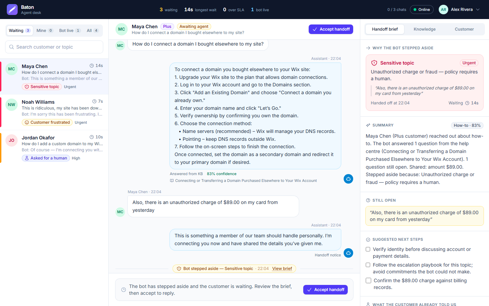
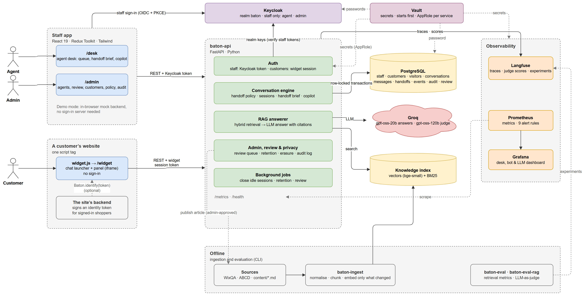
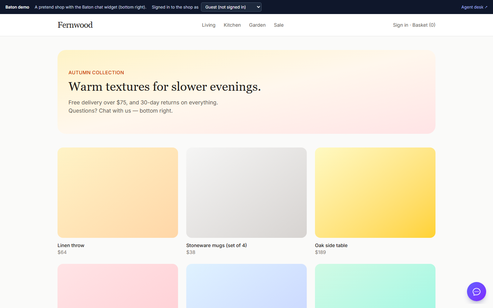
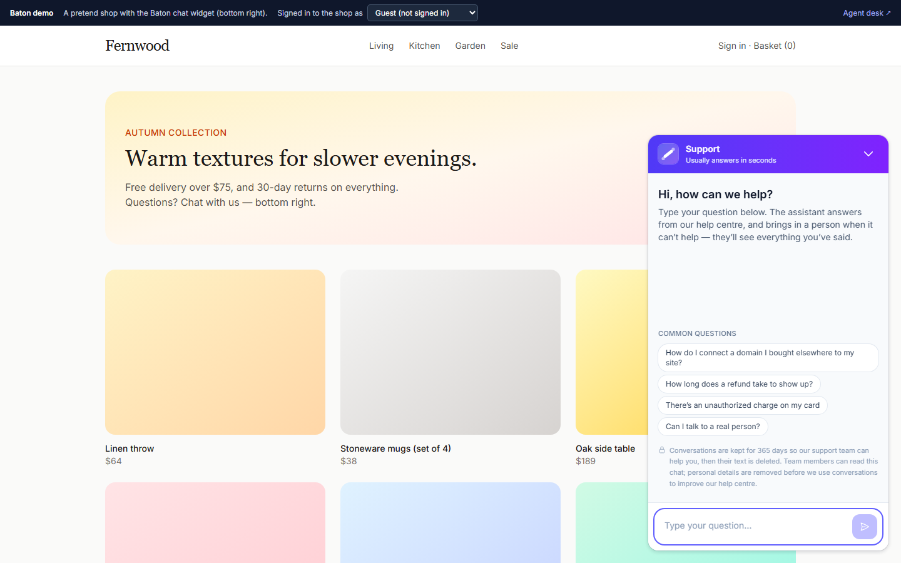
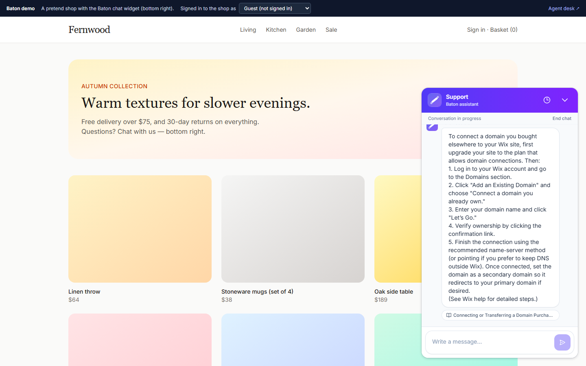
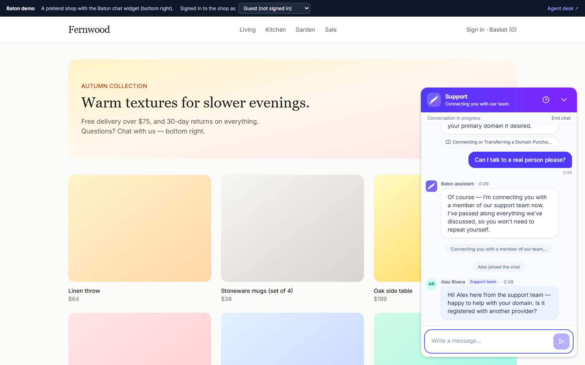
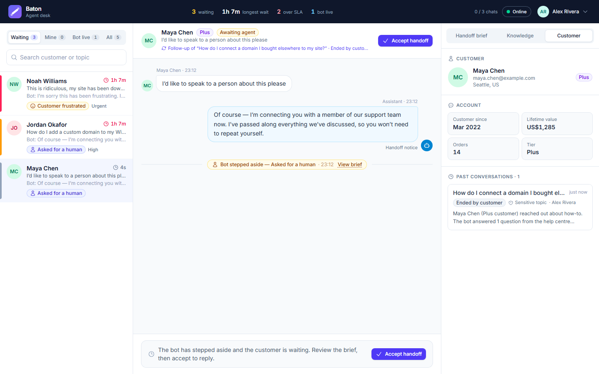
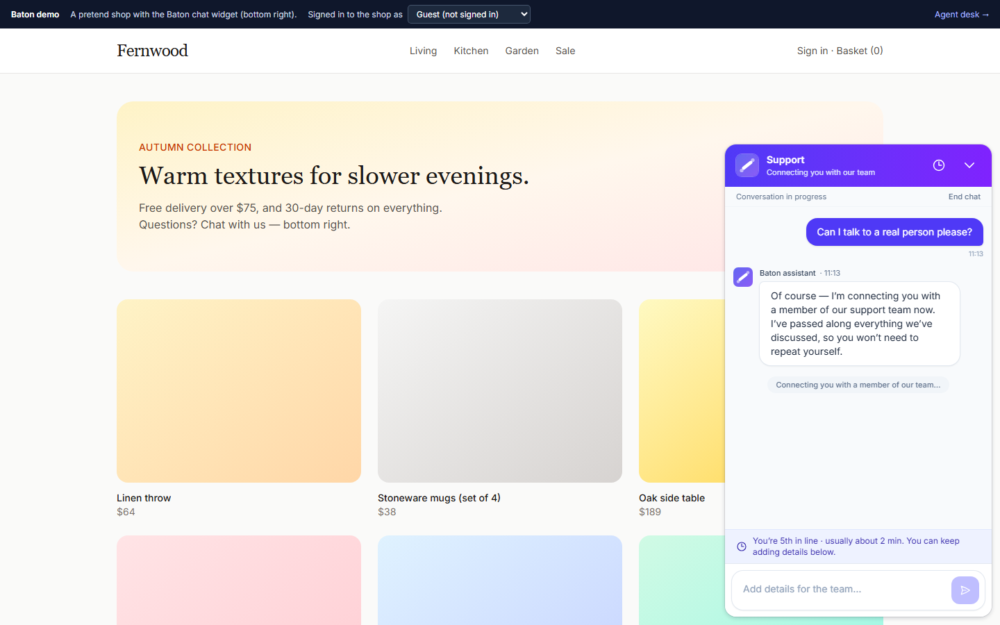
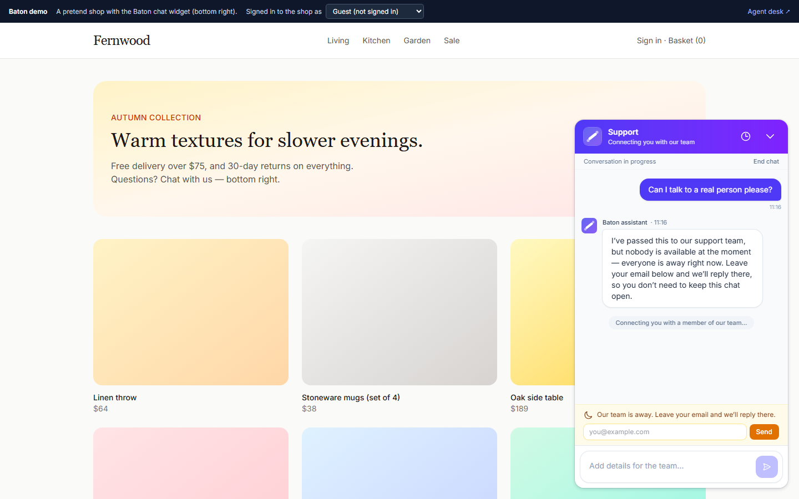
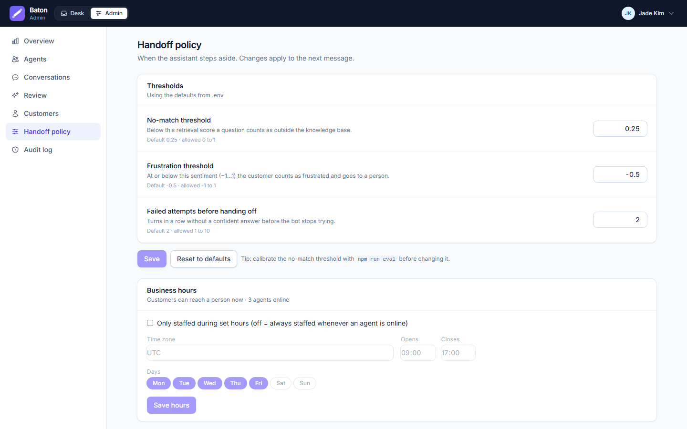

<p align="center"></p>

<h1 align="center">Baton</h1>

<p align="center"><strong>Customer support that knows when to pass the baton.</strong><br/>
A RAG assistant that answers from your help centre with citations — and when it shouldn’t answer, hands the customer to a person with everything it already knows.</p>

<p align="center"></p>

**Contents** · [The problem](#the-problem) · [What it does](#what-it-does) · [Architecture](#architecture) · [How it works](#how-it-works) · [Screenshots](#screenshots) · [Getting started](#getting-started) · [Adding the widget to a website](#adding-the-widget-to-a-website) · [Accounts](#accounts) · [Deploying](#deploying) · [Tech stack](#tech-stack) · [Results](#results) · [Project layout](#project-layout) · [Limitations](#limitations)

## The problem

Support bots fail in two ways. They don’t know when to stop — they guess, invent policies and loop on “could you rephrase?” while fraud reports get the same canned treatment as “where’s my order?”. And when they do give up, the context is lost: the agent opens a blank chat and the customer explains everything again.

Baton treats the handoff as a **first-class state** of every conversation, with its own policy, its own data (the handoff brief), its own queue and SLA.

## What it does

| For | Baton gives them |
|---|---|
| **Customers** | A chat bubble on the company’s website — no account, no sign-in. Answers grounded in the help centre, with the articles cited; an immediate, explained handoff when the bot can’t help. Every visit is a fresh session; past ones stay as read-only history they can follow up on. |
| **Agents** | A queue sorted by urgency and wait, and for each handoff a **brief**: why the bot stepped aside, a summary, open questions, what it already tried, extracted order IDs and amounts, sentiment, sources and the matching internal procedure. The customer’s past sessions sit alongside, and a copilot drafts cited replies. New handoffs chime and raise a browser notification; an Online/Away switch tells customers whether anyone is in. |
| **Admins** | Agents and capacity, every conversation, the handoff policy and **business hours** (editable live), an overview of handoff reasons and evaluation scores, a **review queue** that turns closed chats into missing articles and test questions, an **audit log**, and **one-step erasure** of a customer. |

## Architecture

<p align="center"></p>

Customers chat through a **widget** embedded on the company’s website; agents and admins use the **staff app**, signed in with Keycloak. The FastAPI API accepts two kinds of token — Keycloak tokens for staff, widget session tokens for customers — and checks one on every request. Conversations live in Postgres and every change runs inside a short row-locked transaction, so the API can run as several processes; the LLM is called between transactions, never while a conversation is locked, so a slow model can’t stall the rest of the app. Answers come from a local hybrid index (vectors + BM25) and Groq. Langfuse holds traces and evaluation runs; Prometheus and Grafana watch the desk and the LLM. *Edit the diagram:* open [`docs/architecture.drawio`](docs/architecture.drawio) in [draw.io](https://app.diagrams.net).

## How it works

**The handoff lifecycle.** `bot_active → handoff_pending → agent_active → resolved` (an agent can also return the chat to the bot). A policy checks every customer turn and picks one primary reason:

| Reason | Trigger | LLM called? |
|---|---|---|
| Sensitive topic | fraud, legal threat, account deletion, safety | no |
| Asked for a human | the customer asks for a person | no |
| Frustrated | sentiment ≤ −0.5 | no |
| Outside the knowledge base | best match below the no-match threshold (0.70) | no |
| Bot not getting there | two turns in a row without a grounded answer | yes |
| Assistant unavailable | the LLM failed or timed out — the customer never sees an error | yes |
| Agent took over | an agent steps in from the live queue | — |

**One bot turn.** Conversation-level checks run first (no LLM). Then hybrid retrieval; if nothing is close enough the question is out of scope. Otherwise the LLM answers from numbered sources and must cite them — an uncited answer counts as “can’t answer”.

**While the customer waits.** The bot stays quiet — they asked for a person — but nothing they add is lost: each message lands in the brief under *Added while waiting*, extracted details and sentiment refresh, and anything more urgent (a sensitive topic, rising frustration) raises the priority so they move up the queue; it never lowers it. The customer is told once that their messages reach the team, and the queue shows the agent “+N new”.

**When nobody is available.** “Available” means inside business hours (set by an admin; none = always) *and* at least one agent set to Online with the desk open. A customer waiting for a person sees their **place in line** and a typical wait. If nobody is available, the bot says so honestly — “we’re back Monday at 09:00 (WAT)” — and asks for an email unless the website already vouched for one; the request then **stays in the queue** for the team’s return instead of being dropped, and when an agent replies after the customer has left, the reply goes to them **by email**. Agents hear about new handoffs in the desk (a chime — a different one for urgent — a browser notification and the count in the tab title); a handoff that waits past `ALERT_AFTER_SECONDS`, or arrives while nobody is in, is escalated **once** by email and optionally to a Slack/Teams webhook. Emailing every handoff would teach people to ignore the emails.

**Sessions.** A conversation is one support session and never reopens. It closes when an agent resolves it, the customer ends it, nobody writes for 30 minutes, or a customer waiting for an agent has left (their chat window stopped polling) — unless we can answer them by email, in which case it waits up to `OFFLINE_FOLLOWUP_DAYS`. A customer has at most one live session; reloading rejoins it. **Follow up on this** starts a new session linked to the old one — the agent sees the link and the customer’s timeline; the bot only ever sees the current session.

**Knowledge.** Sources (your Markdown, the WixQA help centre, ABCD agent procedures) are normalised, chunked by heading, de-duplicated and embedded locally with `bge-small-en-v1.5`. Only changed text is re-embedded, and an interrupted build resumes from a checkpoint.

**Learning and data rules.**

| | |
|---|---|
| **Review queue** | Closed sessions are redacted (emails, cards, phones, IBANs, order numbers, the customer’s name), then questions the help centre couldn’t answer are grouped into *knowledge gaps* and agent-resolved handoffs become *test questions*. An admin publishes the missing article (indexed incrementally, live within a minute) or approves the test question. Nothing is published automatically. |
| **Retention** | After `RETENTION_DAYS` (365) a closed conversation loses its text and its Langfuse traces; its shape stays for reporting. |
| **Erasure** | One action removes a customer’s profile, conversations and Langfuse traces, ends their widget sessions at once, and reports what was deleted. |
| **Audit log** | Every transcript a staff member opens, every erasure and every admin change. |
| **Notice** | Customers see in the chat how long conversations are kept and how they’re used. |

**Customers don’t sign in.** A guest who opens the chat gets an anonymous *visitor* session. If the shopper is signed in to the website, the website’s backend vouches for them with a short-lived identity token, so their chats join one customer record across devices (see [Adding the widget](#adding-the-widget-to-a-website)). Signing out of the website falls back to the guest’s own chats; one customer never sees another’s.

**Security.** Staff sign in with Keycloak (authorization code flow with PKCE; tokens stay in memory); Keycloak holds staff only and registration is off. The API verifies every token’s signature, issuer, audience and expiry locally, pins the algorithm per issuer, and authorises every route by role. Widget sessions are signed by the API, last 30 days for a visitor and 12 hours for an identified customer, and are rate-limited per IP and per customer. Customers reach only their own conversations, through a view without the brief or scores; staff tokens can’t act as customers; agent actions take the agent from the token, never the request body. Only `VITE_*` variables reach the browser, and the build refuses any that look like secrets.

## Screenshots

| Widget: on the website | Widget: type a question | Widget: cited answer |
|---|---|---|
|  |  |  |
| **Widget: an agent took over** | **Agent: handoff brief** | **Agent: follow-up and timeline** |
|  |  |  |
| **Widget: place in line** | **Widget: team away** | **Admin: business hours** |
|  |  |  |

More in [`docs/screenshots/`](docs/screenshots/).

## Getting started

**Quick demo — one minute, nothing else needed.** The web app has an in-browser mock backend and a persona picker:

```bash
cp .env.example .env              # leave VITE_API_URL and VITE_KEYCLOAK_URL empty
cd frontend && npm install && cd ..
npm run dev                       # http://localhost:5173 → be Alex or Jade, or “Be a customer instead”
```

**Full stack.** Needs Node 20+, Python 3.12+ with [uv](https://docs.astral.sh/uv/), Docker Desktop and a [Groq API key](https://console.groq.com/keys).

1. `cp .env.example .env` and replace every `change-me` (the file explains each setting). Set `GROQ_API_KEY`, `VITE_API_URL=http://localhost:8787` and `VITE_KEYCLOAK_URL=http://localhost:8080`.
2. `npm run infra:up` — Postgres (:5433), Keycloak (:8080), Vault (:8200) and Mailpit (:8025). The first start imports the realm (staff roles and demo staff) and puts the API’s secrets from `.env` into Vault.
3. `cd backend && uv sync && cd ..` then `npm run ingest` — the first build downloads the data and embeds ~24,000 chunks on the CPU (about an hour, resumable).
4. `npm run api` and `npm run dev` in two terminals. Chat as a customer at http://localhost:5173/demo-store; sign in to the staff app at http://localhost:5173 (see [Accounts](#accounts)).
5. Optional: `npm run obs:up` for Langfuse (:3000), Grafana (:3001) and Prometheus (:9092).

**Everything in Docker.** Same `.env` (steps 1 above), no Node or Python needed:

```bash
npm run app:up        # Postgres, Keycloak, Mailpit, API, web → http://localhost:5173 (stop `npm run dev` first)
npm run app:ingest    # once: builds the knowledge index into the baton_data volume (about an hour on a CPU)
```

Already built the index from source? Copy it into the volume instead of re-ingesting:
`docker run --rm -v baton_baton_data:/data -v "$PWD/data:/src:ro" alpine sh -c "cd /src && tar -cf - index models | tar -C /data -xf - && chown -R 10001:10001 /data"`.

| Command | Does |
|---|---|
| `npm run accounts` | Print every login with its URL and password |
| `npm run dev` · `npm run api` | Staff app, widget and demo store · API (OpenAPI docs at http://localhost:8787/docs) |
| `npm run ingest` | Build or update the knowledge index |
| `npm run eval` · `npm run eval:rag` | Retrieval metrics · end-to-end Langfuse experiment (`-- --include-reviewed` adds approved test questions) |
| `npm test` | Backend tests |
| `npm run infra:up` / `infra:down` · `npm run obs:up` / `obs:down` | Postgres, Keycloak, Vault, Mailpit · monitoring stack |
| `npm run vault:seed` | Copy the API’s secrets from `.env` into Vault again (after changing them) |
| `npm run app:up` / `app:down` · `app:logs` · `app:ingest` | The whole app as containers · their logs · build the index in Docker |

## Adding the widget to a website

One tag, anywhere on the page:

```html
<script src="https://YOUR-BATON-HOST/widget.js" async></script>
```

A launcher appears bottom right and opens the chat in an iframe (full screen on phones), so the site’s styles can’t break it and it can’t read the page. That is all guests need.

**Signed-in shoppers.** So a returning customer sees their own history on any device, the website’s backend signs an identity token — an HS256 JWT with `WIDGET_IDENTITY_SECRET` — and the page passes it in:

```js
// claims: sub = your user id (required), name, email, iat, exp (at most 24 h after iat)
Baton.identify(identityToken);   // on each page load while they're signed in
Baton.logout();                  // when they sign out of your site
Baton.open(); Baton.close();     // optional
```

The secret never reaches the browser. The demo store at `/demo-store` plays the website: its “Signed in to the shop as” menu gets tokens from a demo-only endpoint that exists only while `WIDGET_DEMO_IDENTITY=true` — keep it `false` in production.

## Accounts

All passwords live in **one block at the top of `.env`**. Run `npm run accounts` to print them with their URLs.

| Who | Where | Username | Password (in `.env`) |
|---|---|---|---|
| Customers | http://localhost:5173/demo-store | none — guests chat anonymously; the demo bar “signs in” to the shop as a seeded customer | — |
| Agents | http://localhost:5173 (staff app) | `alex.rivera`, `priya.shah` | `BATON_DEMO_PASSWORD` |
| Admin | http://localhost:5173 (staff app) | `jade.kim` (admin and agent) | `BATON_DEMO_PASSWORD` |
| Keycloak admin console | http://localhost:8080/admin | `KEYCLOAK_ADMIN_USER` (default `admin`) | `KEYCLOAK_ADMIN_PASSWORD` |
| Langfuse | http://localhost:3000 | `LANGFUSE_INIT_USER_EMAIL` | `LANGFUSE_INIT_USER_PASSWORD` |
| Grafana | http://localhost:3001 | `GRAFANA_ADMIN_USER` | `GRAFANA_ADMIN_PASSWORD` |
| Mailpit (every email the app sends) | http://localhost:8025 | none | — |
| Vault (the API’s secrets) | http://localhost:8200 | method: Token | root token in `infra/vault/local/init.txt` |

Keycloak holds staff only: add agents in its admin console and give them the `agent` role. The demo password applies when Keycloak first imports the realm; afterwards, change passwords there.

## Deploying

Two images, configured only by environment variables (nothing secret is baked in; `.env` never reaches a build):

| Image | Built from | Notes |
|---|---|---|
| `baton-api` | `backend/Dockerfile` | Python 3.12 slim, CPU-only PyTorch, runs as a non-root user. Mount `/app/data` (index + models) and `/app/content` (articles). `API_WORKERS` sets processes; the app is built to run as several. |
| `baton-web` | `frontend/Dockerfile` | nginx (unprivileged). `VITE_*` settings are read **when the container starts**, so one image serves anyone’s URLs. `WIDGET_FRAME_ANCESTORS` lists the sites allowed to embed the chat widget; the staff app can’t be framed. |

**Secrets: HashiCorp Vault.** The API’s secrets (Groq key, widget secrets, Keycloak service-account secret, Langfuse keys, SMTP password, webhook URL) live in Vault at `secret/baton/api`. At startup the API logs in with **AppRole** under a policy that can read that one path and nothing else, and it refuses to start if Vault is configured but unreachable. `npm run infra:up` runs Vault as a real server (not `-dev` mode); a one-shot `vault-init` container initialises and unseals it, sets up the policy and AppRole, and the first time copies the secrets from `.env` (`npm run vault:seed` re-copies them). Locally the unseal key and root token sit in `infra/vault/local/` (git-ignored) — treat that folder like `.env`. In production, use KMS auto-unseal (the `seal "awskms"` stanza in `infra/vault/config/vault.hcl`), raft storage across three nodes, TLS, and the AWS IAM auth method instead of a secret_id on disk. Infrastructure passwords (Postgres, Keycloak) stay with Docker/RDS because those start before Vault. Without `VAULT_ADDR`, the API simply reads environment variables.

**A sensible AWS shape.** A public subnet with the load balancer (HTTPS via ACM) and the NAT gateway; private subnets for the API and web containers (ECS Fargate or EC2), Keycloak, Vault, and Postgres (RDS). Then tighten for production: `CORS_ORIGIN` and `BATON_WEB_URL` to your domain, `WIDGET_FRAME_ANCESTORS` to your shop’s domains, `WIDGET_DEMO_IDENTITY=false`, Keycloak in production mode (`start`, behind TLS), and `SMTP_*` pointing at a real provider (for example Amazon SES).

## Tech stack

| Layer | Technology |
|---|---|
| Frontend | React 19 · Vite 8 · Redux Toolkit 2 (RTK Query) · Tailwind CSS 4 · keycloak-js · embeddable widget (iframe + `postMessage`) |
| API | Python 3.12 · FastAPI · Pydantic 2 · PyJWT · psycopg 3 |
| Secrets | HashiCorp Vault 1.20 — KV v2, AppRole login, read-only policy for the API |
| Identity | Keycloak 26 for staff (realm `baton`, roles `agent` / `admin`) · signed widget sessions and website identity tokens for customers |
| Database | PostgreSQL 17 — versioned schema, row-locked conversation transactions |
| Retrieval | sentence-transformers `bge-small-en-v1.5` (local CPU) · BM25 · reciprocal rank fusion |
| LLM | Groq · `openai/gpt-oss-20b` (answers, copilot) · `openai/gpt-oss-120b` (judge) |
| Observability | Langfuse 4 (traces, LLM-as-judge, experiments) · Prometheus 3 · Grafana 13 |
| Notifications | SMTP (Mailpit locally) · Slack/Mattermost/Teams webhook · browser Notification API |
| Packaging | Docker images: API (python:3.12-slim, CPU PyTorch, non-root) · web (nginx-unprivileged, runtime config) |
| Tooling | uv · ruff · pytest · Docker Compose |

## Results

**Retrieval** — 200 expert-written WixQA questions over 6,192 articles (`npm run eval`):

| Mode | hit@1 | hit@5 | hit@10 | MRR |
|---|---|---|---|---|
| Vector | 36% | 71% | 80% | 0.51 |
| Keyword (BM25) | 26% | 58% | 69% | 0.39 |
| **Hybrid (default)** | 35% | **73%** | 81% | 0.50 |
| Hybrid + `bge-reranker-base` | 40% | 72% | 83% | 0.53 |

A no-match threshold of 0.70 catches 98% of off-topic questions while flagging 5% of real ones. The reranker helps the top result but costs ~12 s per question on a CPU, so it’s off by default (`RERANKER_MODEL`).

**End to end** — 50 WixQA questions + 10 off-topic, `gpt-oss-20b` judged by `gpt-oss-120b` (`npm run eval:rag`): **97% faithful**, **100%** of off-topic questions handed off, 96% answered, 68% correct, **56% correct and grounded**. The bottleneck is retrieval: in a third of cases the right facts aren’t in the context (context recall 64%).

## Project layout

```
frontend/       React app — features/widget (customer chat), features/demoStore, desk and admin; public/widget.js (embed script) · Dockerfile + docker/ (nginx, runtime config)
backend/        FastAPI app (uv) — api/, auth.py, secrets.py (Vault), db/, conversation/, team.py (hours, presence, queue), notify/ (email, webhook, alerts), rag/, ingest/, review/, privacy/, eval/ · Dockerfile
infra/          compose file (Postgres, Keycloak, Vault, Mailpit; the app itself with the "app" profile), realm import, Vault config/policy/init, database init
observability/  Langfuse + Prometheus + Grafana: compose file, dashboard, alert rules
content/        your own Markdown help-centre articles (published review articles land here)
docs/           architecture diagram (draw.io) and screenshots
scripts/        accounts.mjs (npm run accounts)
```

`npm test` runs 119 backend tests with no network or keys; 7 more test the Postgres repository against a disposable database (see the top of `backend/tests/test_postgres.py`).

## Limitations

- Several API processes are supported, with small caveats: disabling an agent takes up to 30 s everywhere, rate limits are counted per process, and Grafana should aggregate the desk gauges with `max`.
- Redaction is rule-based, so an admin checks every review item before it is published.
- A guest’s session lives in the widget’s storage. Browsers that block or partition third-party storage may start a guest afresh on another site or visit; identified shoppers are unaffected.
- The apps poll; Server-Sent Events would cut latency. Keycloak runs in development mode — use production mode with TLS for real deployments.
- Desk sound alerts start after the agent’s first click on the page (browsers block sound until then); desktop notifications need the browser’s permission. Business hours can’t span midnight, and customers can’t reply by email (replies come back to the chat).
- The demo knowledge base is the Wix help centre, so some answers address a site owner rather than a shop customer.

**Data:** [WixQA](https://huggingface.co/datasets/Wix/WixQA) (MIT) · [ABCD](https://github.com/asappresearch/abcd) (MIT) · [bge-small-en-v1.5](https://huggingface.co/BAAI/bge-small-en-v1.5) (MIT).
