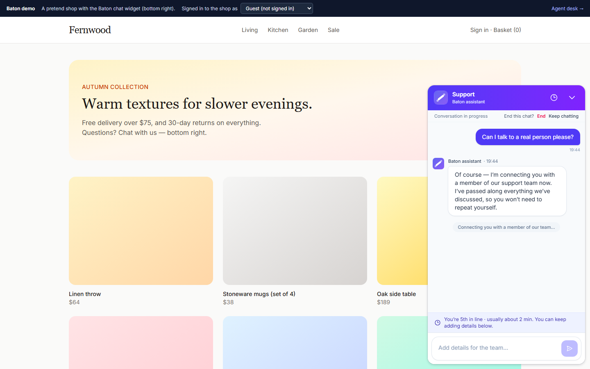
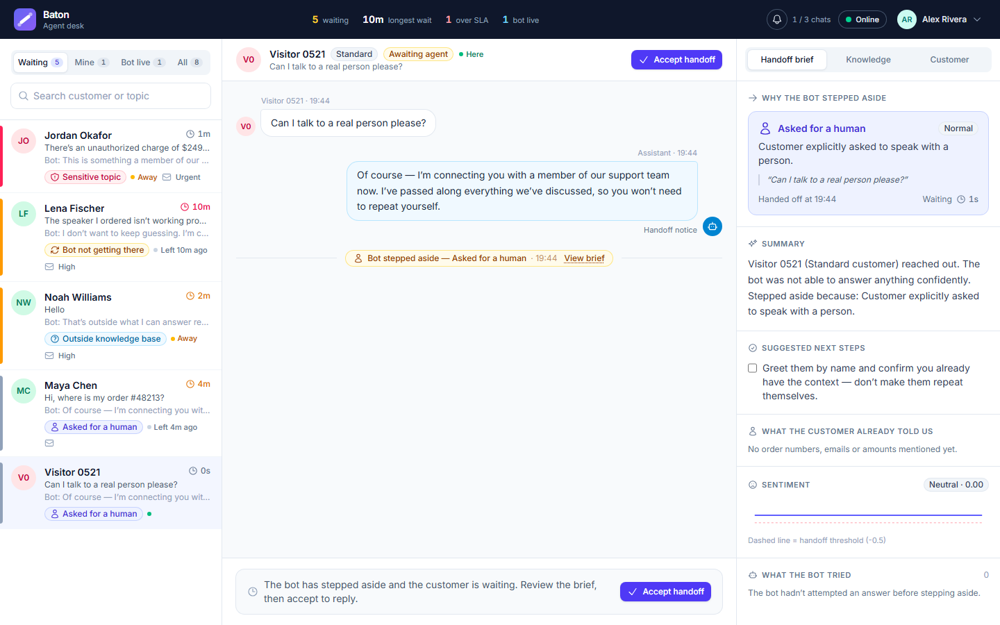

# How Baton works

[← Back to the README](../README.md)

## The handoff lifecycle

`bot_active → handoff_pending → agent_active → resolved` (an agent can also return the chat to the bot). A policy checks every customer turn and picks one primary reason:

| Reason | Trigger | LLM called? |
|---|---|---|
| Sensitive topic | fraud, legal threat, account deletion, safety | no |
| Asked for a human | the customer asks for a person | no |
| Frustrated | sentiment ≤ −0.5 | no |
| Outside the knowledge base | best match below the no-match threshold (0.70) | no |
| Bot not getting there | two turns in a row without a grounded answer | yes |
| Assistant unavailable | the LLM failed or timed out — the customer never sees an error | yes |
| Agent took over | an agent steps in from the live queue | — |

**One bot turn.** Conversation-level checks run first (no LLM). Then hybrid retrieval; if nothing is close enough the question is out of scope. Otherwise the LLM answers from numbered sources and must cite them — an uncited answer counts as “can’t answer”. The LLM is called between short database transactions, never while a conversation is locked, so a slow model can’t stall the rest of the app.

**The handoff brief.** Why the bot stepped aside, a summary, open questions, what it already tried, extracted order IDs and amounts, sentiment, sources and the matching internal procedure. The customer’s past sessions sit alongside, and a copilot drafts cited replies.

## While the customer waits

The bot stays quiet — they asked for a person — but nothing they add is lost: each message lands in the brief under *Added while waiting*, extracted details and sentiment refresh, and anything more urgent (a sensitive topic, rising frustration) raises the priority so they move up the queue; it never lowers it. The customer is told once that their messages reach the team, sees their **place in line** and a typical wait, and the queue shows the agent “+N new”.

## When nobody is available

“Available” means inside business hours (set by an admin; none = always) *and* at least one agent set to Online with the desk open. If nobody is available, the bot says so honestly — “we’re back Monday at 09:00 (WAT)” — and asks for an email unless the website already vouched for one; the request **stays in the queue** for the team’s return, and when an agent replies after the customer has left, the reply goes **by email**.

Agents hear about new handoffs in the desk (a chime — a different one for urgent — a browser notification and the count in the tab title). A handoff that waits past `ALERT_AFTER_SECONDS`, or arrives while nobody is in, is escalated **once** by email and optionally to a Slack/Teams webhook.

## Sessions

A conversation is one support session and never reopens. While the shop page is open the widget says *here* every 15 s — panel open or minimised — and *left* when the page closes, so the API knows whether anyone is still there. Every session ends one of these ways:

| What happens | With the bot | Waiting for an agent | With an agent |
|---|---|---|---|
| Customer clicks **End chat** (and confirms) | ended | ended | ended |
| Customer closes the page and isn’t back within 60 s | closed: *left* | closed: *abandoned* | agent sees “left” — the agent decides |
| No heartbeat for 3 min (crash, lost network) | closed: *left* | closed: *abandoned* after 10 min | agent sees “left” |
| Page open, nobody writes for 30 min | “Are you still there?” at 25 min, then closed: *inactive* | — | closed: *inactive* |
| Agent resolves it | — | — | resolved |

Coming back within the grace — the next page of the shop, a reload — rejoins the same chat. A customer who left an email while waiting isn’t closed as abandoned: the chat waits up to `OFFLINE_FOLLOWUP_DAYS` for the reply. The desk shows each customer as **Here**, **Away** or **Left 2 min ago**, and the thread records when they leave and come back. The timings are settings in [`.env.example`](../.env.example).

| End chat asks first | The desk shows who’s still there |
|---|---|
|  |  |

A customer has at most one live session; reloading rejoins it. **Follow up on this** starts a new session linked to the old one — the agent sees the link and the customer’s timeline; the bot only ever sees the current session.

**Customers don’t sign in.** A guest gets an anonymous *visitor* session. If the shopper is signed in to the website, its backend vouches for them with a short-lived identity token, so their chats join one customer record across devices ([embedding the widget](guide.md#adding-the-widget-to-a-website)).

## Knowledge

Sources (your Markdown, the WixQA help centre, ABCD agent procedures) are normalised, chunked by heading, de-duplicated and embedded locally with `bge-small-en-v1.5`. Only changed text is re-embedded, and an interrupted build resumes from a checkpoint. Retrieval is hybrid: vectors and BM25, merged with reciprocal rank fusion.

## Learning and data rules

| | |
|---|---|
| **Review queue** | Closed sessions are redacted (emails, cards, phones, IBANs, order numbers, the customer’s name), then questions the help centre couldn’t answer are grouped into *knowledge gaps* and agent-resolved handoffs become *test questions*. An admin publishes the missing article (indexed incrementally, live within a minute) or approves the test question. Nothing is published automatically. |
| **Retention** | After `RETENTION_DAYS` (365) a closed conversation loses its text and its Langfuse traces; its shape stays for reporting. |
| **Erasure** | One action removes a customer’s profile, conversations and Langfuse traces, ends their widget sessions at once, and reports what was deleted. |
| **Audit log** | Every transcript a staff member opens, every erasure and every admin change. |
| **Notice** | Customers see in the chat how long conversations are kept and how they’re used. |

## Security

Staff sign in with Keycloak (authorization code flow with PKCE; tokens stay in memory); Keycloak holds staff only and registration is off. The API verifies every token’s signature, issuer, audience and expiry locally, pins the algorithm per issuer, and authorises every route by role. Widget sessions are signed by the API (30 days for a visitor, 12 hours for an identified customer) and rate-limited per IP and per customer. Customers reach only their own conversations, through a view without the brief or scores; agent actions take the agent from the token, never the request body. Every secret lives in HashiCorp Vault ([details](guide.md#secrets-hashicorp-vault)); only `VITE_*` variables reach the browser, and the build refuses any that look like secrets.
